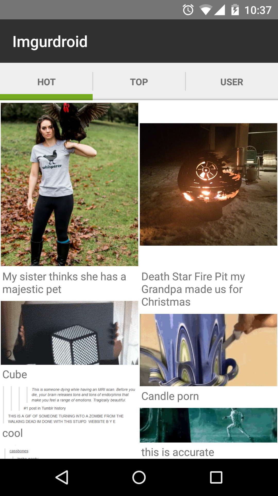

# Imgurdroid
Basic Imgur client for Android. Serves as a sample app for an image gallery fetched from a server.



## Dependencies
Imgurdroid uses Imgur's [API](https://api.imgur.com/) to fetch information.

You'll need to sign up as a developer and add the client ID and secret to your local
`~/.gradle/gradle.properties` as the following:

```
IMGURDROID_CLIENT_ID=your_client_id
IMGURDROID_CLIENT_SECRET=your_client_secret
```

## Libraries
* [Retrofit](http://square.github.io/retrofit/)
* [OkHttp](http://square.github.io/okhttp/)
* [Picasso](http://square.github.io/picasso/)
* [SlidingTabs](https://github.com/nispok/slidingtabs)
* [TinyBus](https://github.com/beworker/tinybus)

## License
    Copyright 2015 William Mora

    Licensed under the Apache License, Version 2.0 (the "License");
    you may not use this file except in compliance with the License.
    You may obtain a copy of the License at

        http://www.apache.org/licenses/LICENSE-2.0

    Unless required by applicable law or agreed to in writing, software
    distributed under the License is distributed on an "AS IS" BASIS,
    WITHOUT WARRANTIES OR CONDITIONS OF ANY KIND, either express or implied.
    See the License for the specific language governing permissions and
    limitations under the License.